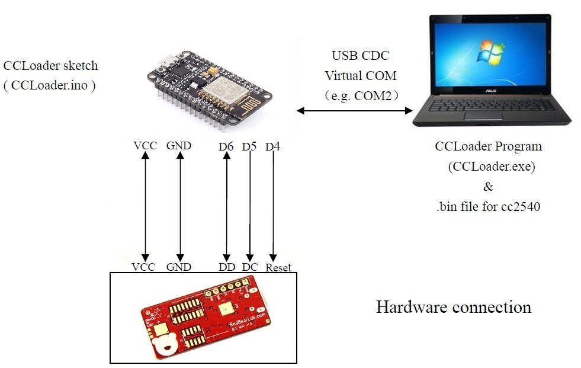

CCLoader
========

Burn CC254x firmware using an NodeMCU board.

1. Load the CCLoader Arduino sketch to the MCU board.
2. Wire the pins:
  
3. Use CCLoader.exe to load the CC2541hm10v540.bin to the MCU board and the board will burn the firmware to the BLE Mini.
